<div align="center">


# AdLex

**A lightweight, self-hosted affiliate tracker in the spirit of Binom.**<br>
Campaigns · Offers · Traffic sources · Website tracking · Brand clicks · Conversion postbacks · Offline-conversion CSV · Triggers · Reports · QA load tests

[](https://nodejs.org)
[](https://expressjs.com)
[](https://ejs.co)
[](#tests)
[](#deploy-to-aws-elastic-beanstalk)
[](#data-layer)

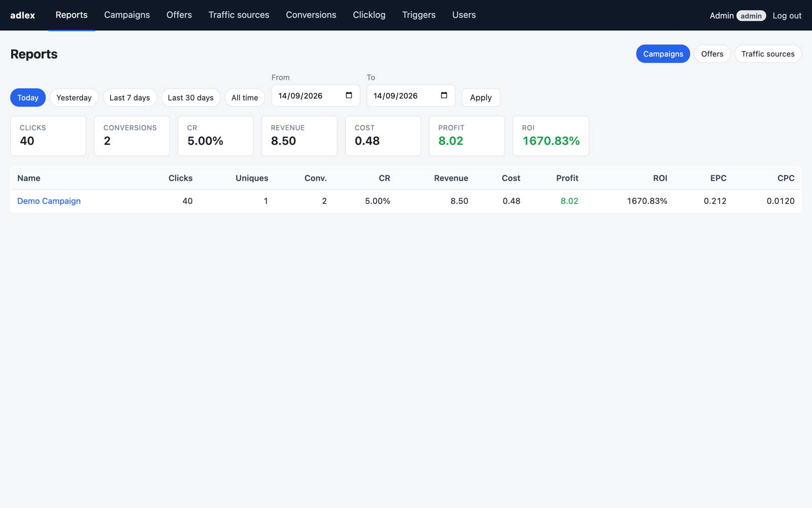

</div>

---

## Table of contents

- [Why AdLex](#why-adlex)
- [Features](#features)
- [How tracking works](#how-tracking-works)
- [Screenshots](#screenshots)
- [Quick start](#quick-start)
- [Usage guide](#usage-guide)
  - [1. Add a traffic source](#1-add-a-traffic-source)
  - [2. Add offers](#2-add-offers)
  - [3. Create a campaign](#3-create-a-campaign)
  - [4. Set up the postback from your network](#4-set-up-the-postback-from-your-network)
  - [5. Add a trigger (postback to the traffic source)](#5-add-a-trigger-postback-to-the-traffic-source)
  - [6. Read the reports](#6-read-the-reports)
- [Macros](#macros)
- [Adding AdLex to a website](#adding-adlex-to-a-website)
- [Public endpoints](#public-endpoints)
- [Website tracking (many sites)](#website-tracking-many-sites)
  - [db.bestoffers.biz compatibility (classic flow)](#dbbestoffersbiz-compatibility-classic-flow)
  - [Redirect-first (Bing → AdLex campaign → your site)](#redirect-first-bing--adlex-campaign--your-site)
  - [QA page (load test)](#qa-page-load-test)
  - [Event bus: direct or Kafka](#event-bus-direct-or-kafka)
- [Roles](#roles)
- [Configuration](#configuration)
- [Data layer](#data-layer)
- [Deploy to AWS Elastic Beanstalk](#deploy-to-aws-elastic-beanstalk)
- [Tests](#tests)
- [Project layout](#project-layout)

---

## Why AdLex

Commercial trackers are heavy and expensive for a handful of campaigns. AdLex gives you the core loop, split-testing offers, matching conversions back to clicks, and telling your traffic source about them, in one small Node.js app with no build step and four runtime dependencies (plus optional Kafka and headless-Chrome drivers). It also works as the tracker behind your own websites: landing sessions, brand clicks and offline-conversion uploads to Google / Microsoft Ads.

## Features

| | |
|---|---|
| 🎯 **Campaigns** | Weighted offer rotation, fallback URL, pause/archive, per-campaign postback token, one-click copy of the campaign URL with your source's macros already filled in |
| 🎁 **Offers** | URL templates with macros, default payout, network label, status |
| 🚦 **Traffic sources** | Parameter mapping (click id, cost, custom params t1…t20, each can be hidden from the campaign URL), cost model (fixed CPC / from param / none), postback token, presets for Bing, Website, PropellerAds and Facebook |
| 🌐 **Websites** | Sites registry (bulk add), `/se/` session ids, brand-click conversions, `?click=<campaign key>` attribution, landing redirects that pass `se` + t1…t20, copy-paste integration scripts |
| 🔁 **Conversions** | Incoming postback with txid de-duplication, upsert of status changes (lead → sale), rejected/refund statuses excluded from revenue, `brandclick` conversions counted apart from sales, early postbacks queued until the click is stored |
| 📤 **Exports** | Offline-conversion CSV for Google Ads / Microsoft Ads / custom layouts, rolling or monthly window, payout on/off, per-brand conversion names, secret URL for scheduled imports, db.bestoffers.biz `/pc/up` format |
| 📣 **Triggers** | Outgoing postbacks to the traffic source or any URL. Per source with per-campaign overrides, GET or POST (form/JSON), status filters, timeouts, retries with backoff, full request/response log with Test and Retry buttons |
| 📊 **Reports** | Clicks, uniques, conversions, CR, revenue, cost, profit, ROI, EPC, CPC grouped by campaign, offer or source, with date presets and custom ranges |
| 🧾 **Clicklog** | Every click with IP, user agent, country, site, ad click id (gclid/msclkid), brand, t1…t20 (pick visible columns), cost, conversion state; filters and cursor pagination |
| 🧪 **QA** | Load tests: waves of headless-Chrome visitors through a campaign link or straight to a site, brand clicks, then a stored-vs-expected check |
| ⚡ **Scale** | Tracking endpoints answer instantly and write in batches through an event bus (in-process or Kafka) |
| 👥 **Users** | Admin and read-only roles, session login, CSRF protection, first admin seeded from env |
| 🔌 **Portable data** | Firestore-shaped adapter over local JSON files today, real Firebase Firestore later with a one-file swap |

## How tracking works


Two ids matter and AdLex never confuses them:

- `{clickid}` is **AdLex's** click id. Put it in offer URLs so the network can send it back.
- `{external_id}` is the **traffic source's** click id, read from the mapped query param. Use it in triggers so the source can attribute the conversion.

## Screenshots

<table>
  <tr>
    <td align="center"><b>Campaign page</b><br>Campaign URL, postback URL, 7-day stats, offer split, triggers in effect<br>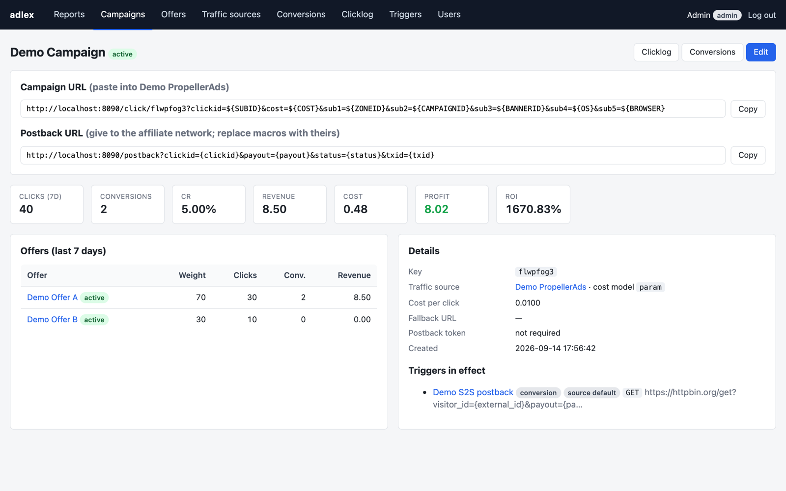</td>
    <td align="center"><b>Campaign editor</b><br>Source, cost, fallback, weighted offers<br>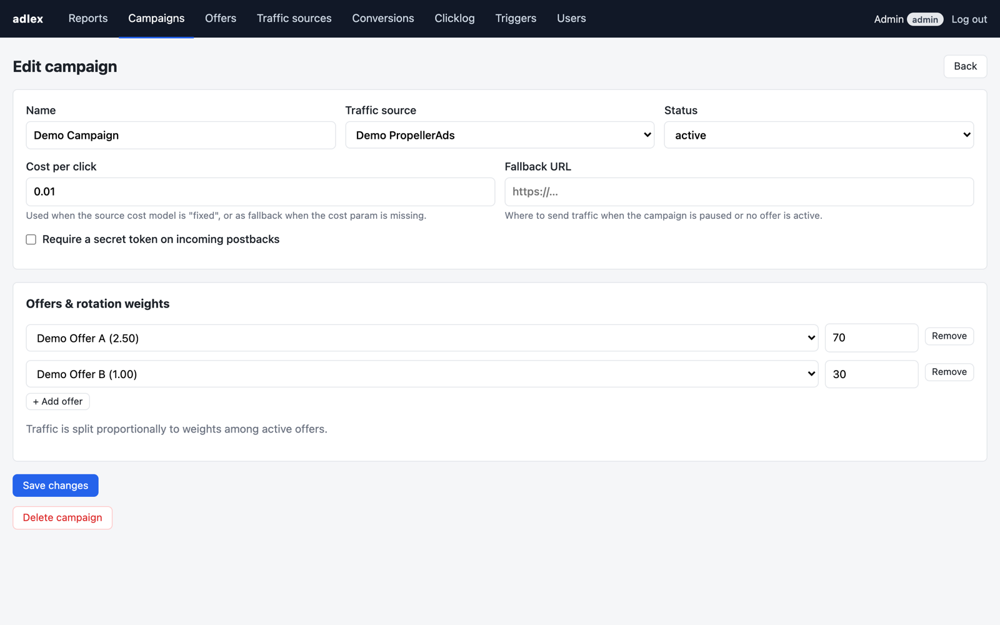</td>
  </tr>
  <tr>
    <td align="center"><b>Traffic source</b><br>Parameter mapping with presets<br>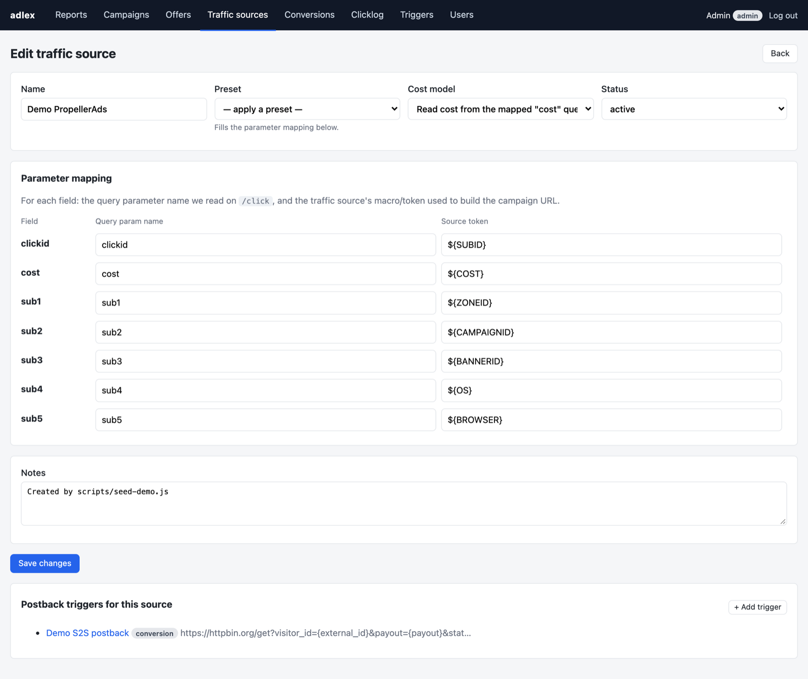</td>
    <td align="center"><b>Trigger editor</b><br>Outgoing postback with macros, retries, status filter<br>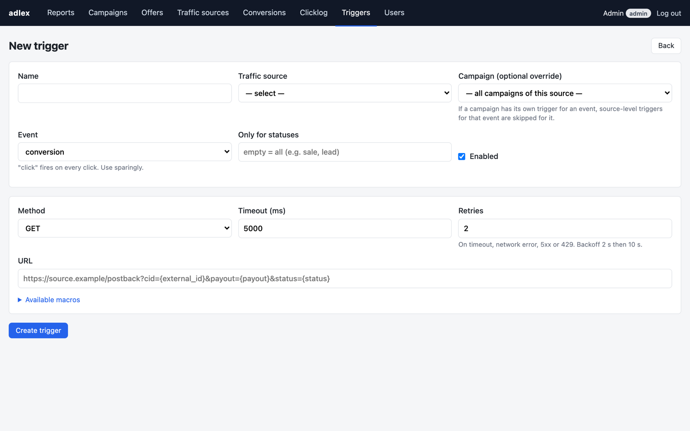</td>
  </tr>
  <tr>
    <td align="center"><b>Postback logs</b><br>Every attempt with resolved URL, response and Retry<br>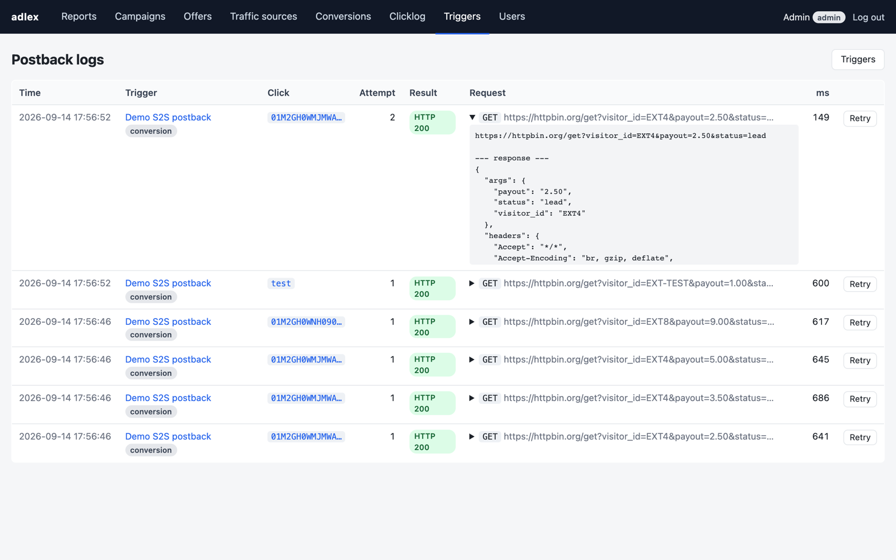</td>
    <td align="center"><b>Clicklog</b><br>Filters, date range, cursor pagination<br>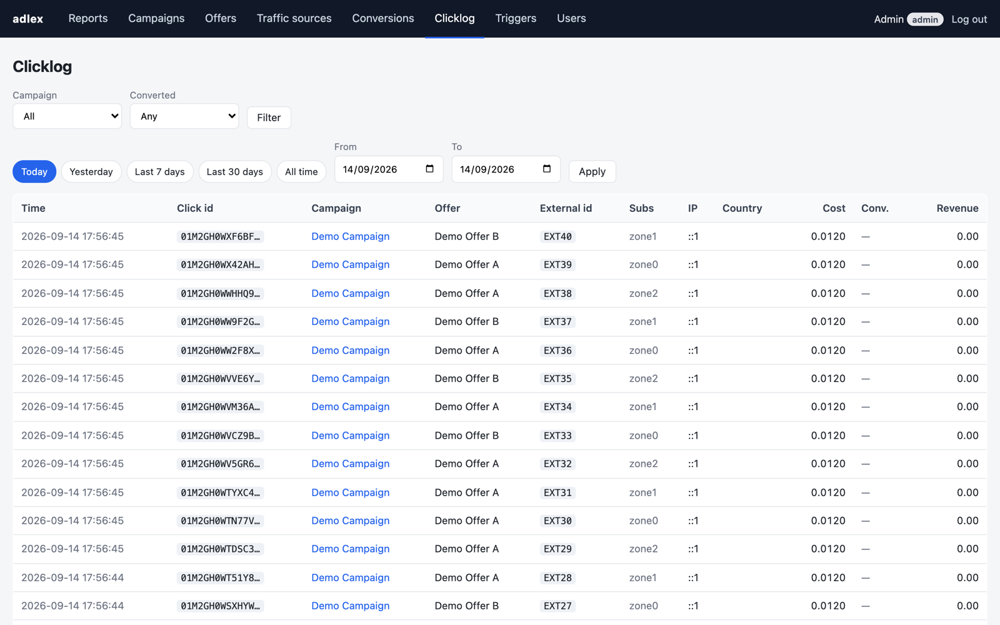</td>
  </tr>
  <tr>
    <td align="center"><b>Conversions</b><br>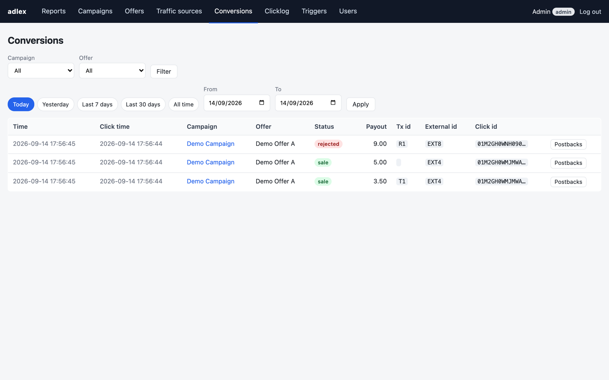</td>
    <td align="center"><b>Offers</b><br>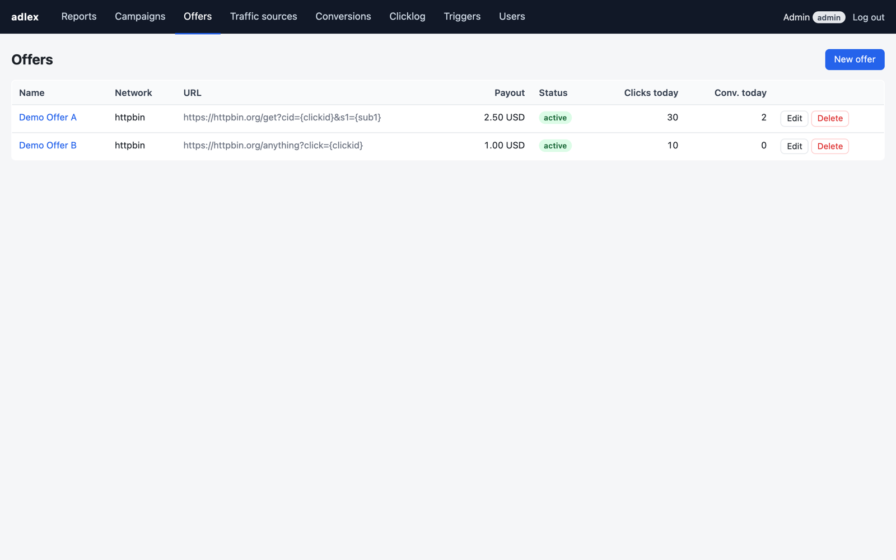</td>
  </tr>
  <tr>
    <td align="center"><b>Triggers</b><br>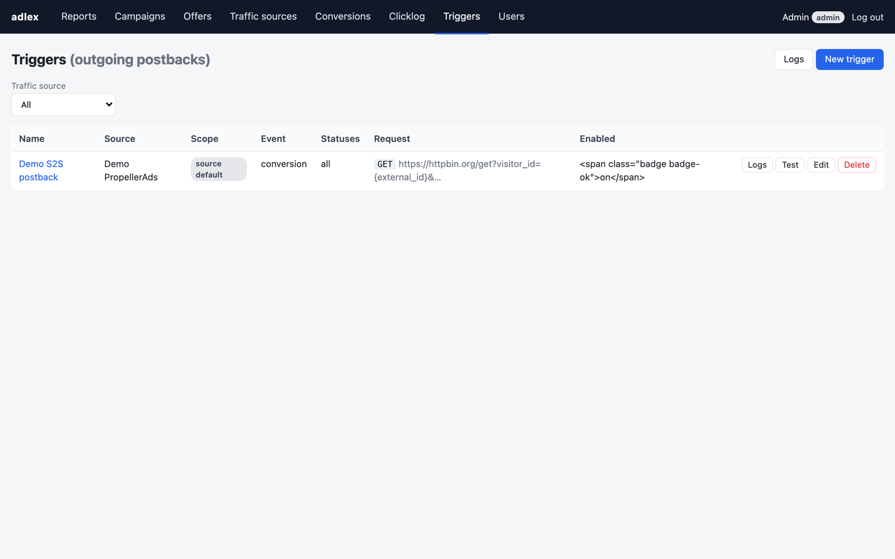</td>
    <td align="center"><b>Users</b><br>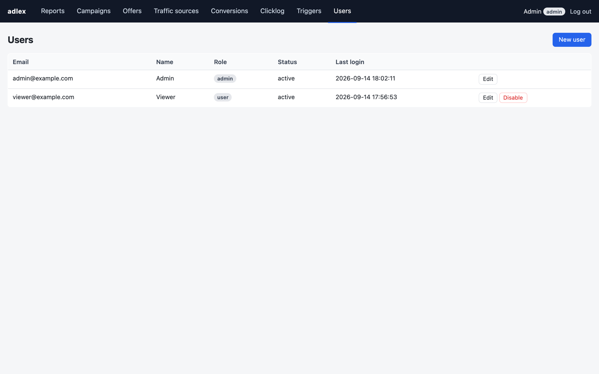</td>
  </tr>
</table>

## Quick start

Requires Node.js 22 or newer.

```bash
git clone <this repo> adlex && cd adlex
npm install
cp .env.example .env          # set ADMIN_EMAIL and ADMIN_PASSWORD
npm run seed                  # optional demo data (run while the server is stopped)
npm run dev                   # http://localhost:8080
```

Log in with the admin email and password from `.env`. The seed script prints a ready-to-use campaign URL; you can also drive traffic through it from the terminal:

```bash
scripts/simulate.sh <campaignKey> 20 2     # 20 clicks, 2 postbacks
```

> **Note**
> The JSON store keeps each collection in memory per process. Never run two processes (for example `npm run seed` and the server) against the same `DATA_DIR` at the same time.

## Usage guide

### 1. Add a traffic source

**Traffic sources → New source** (or use the **+ PropellerAds** / **+ Facebook** shortcuts).

For each field, set the **query param name** AdLex should read on `/click`, and the **source token** the source substitutes when it builds the URL. Choose the cost model:

| Cost model | Meaning |
|---|---|
| `cpc` | Every click costs the campaign's *Cost per click* |
| `param` | Read the cost from the mapped `cost` param; fall back to the campaign CPC if missing |
| `none` | No cost tracking |

### 2. Add offers

**Offers → New offer.** Paste the network's tracking link and put `{clickid}` where the network expects its sub id or click id, e.g.

```
https://network.example/aff_c?offer_id=123&aff_sub={clickid}&aff_sub2={t1}
```

Set the default payout: it is used when a postback arrives without a `payout` parameter.

### 3. Create a campaign

**Campaigns → New campaign.** Pick the traffic source, add one or more offers with weights (70 / 30 sends roughly 70 % of clicks to the first offer), set the CPC and optionally a fallback URL and a postback token.

Open the campaign and press **Copy** next to **Campaign URL**. It already contains your source's macros:

```
https://your.domain/click/k7x2m9qa?clickid=${SUBID}&cost=${COST}&t1=${ZONEID}
```

Paste that into the traffic source as the landing URL.

### 4. Set up the postback from your network

Copy the **Postback URL** from the campaign page and give it to the affiliate network, replacing the macros with the network's own:

```
https://your.domain/postback?clickid={clickid}&payout={payout}&status={status}&txid={txid}
```

Behaviour:

| Situation | Response |
|---|---|
| New conversion | `OK` |
| Same `clickid` + `txid` again | `DUPLICATE` (ignored) |
| No `txid`, first time | `OK` |
| No `txid`, again (e.g. lead → sale) | `UPDATED` (status and payout replaced) |
| Unknown `clickid` | `404 ERR unknown clickid` |
| Missing `clickid` | `400 ERR missing clickid` |
| Wrong `token` on a protected campaign | `403 ERR bad token` |

Statuses `rejected`, `refund`, `chargeback`, `cancelled` are stored but excluded from revenue.

### 5. Add a trigger (postback to the traffic source)

**Triggers → New trigger.** Choose the source, the event (`conversion` or `click`), the method and the URL template:

```
https://ad-network.example/conversion?visitor_id={external_id}&payout={payout}&status={status}
```

- Leave **Campaign** empty to make it the default for every campaign of that source. Set a campaign to override the default for that campaign only.
- **Only for statuses** limits firing to, say, `sale`.
- Failed attempts (timeout, network error, 5xx, 429) are retried with 2 s and 10 s backoff. Every attempt is logged under **Triggers → Logs** with the resolved URL, body, response and duration. Use **Test** to fire a sample request and **Retry** to resend a logged one.

### 6. Read the reports

**Reports** groups by campaign, offer or source for Today, Yesterday, 7 days, 30 days, All time or a custom range. Conversions are attributed to the **click's** date, so CR and ROI stay consistent for a range. The **Conversions** tab, by contrast, lists conversions by the time the postback arrived.

## Macros

Usable in offer URLs, trigger URLs and trigger bodies. Values are URL-encoded (or JSON-escaped in JSON bodies); unknown macros render as empty strings.

| Macro | Value |
|---|---|
| `{clickid}` | AdLex click id |
| `{external_id}` | traffic source's click id |
| `{campaign_id}` `{campaign_name}` `{campaign_key}` | campaign |
| `{source_id}` `{source_name}` | traffic source |
| `{offer_id}` `{offer_name}` | offer |
| `{payout}` | conversion payout, 2 decimals |
| `{cost}` | click cost |
| `{status}` `{txid}` `{conversion_id}` | conversion |
| `{t1}` … `{t20}` | custom traffic source params (`{sub1}`…`{sub5}` still work as aliases of t1…t5) |
| `{gclid}` `{msclkid}` `{fbclid}` `{ad_click_id}` `{ad_click_type}` | ad platform click id captured by `/se/` |
| `{brand}` `{domain}` `{page_url}` | website: last brand clicked, site domain, landing page |
| `{event_name}` | event name sent with a `/pc/` postback |
| `{ip}` `{country}` `{ua}` `{referer}` | visitor |
| `{timestamp}` `{date}` | event time (ms) and `YYYY-MM-DD` |

## Adding AdLex to a website

The **Integration** page (top menu) has step-by-step instructions and three copy-paste scripts with this AdLex's address filled in (sources: `src/integration/*.html`):

1. **Session** (`<head>`): keeps the landing params in cookies and gets the click id `se` — from `?se=` when the visitor came through an AdLex campaign link, otherwise from `/se/` (add `click=<campaign key>` to the landing URL to count it under a campaign).
2. **Link tokens**: fills `{se}`, `{clickId}`, `{keyword}` … (or `%7B…%7D`) in link URLs after load, including links rendered later, and again when `se` arrives.
3. **Brand clicks**: a click on a link with `brand=` sends a `brandclick` conversion via `sendBeacon`; the link is never blocked.

Product links: `https://network/offer?sub1={se}&sub2={clickIdType}&sub3={clickId}&brand=trim`. Network postback: `/postback?clickid={sub1}&payout=…&token=…`.

## Public endpoints

| Method | Path | Purpose |
|---|---|---|
| `GET` | `/click/:campaignKey` | Redirect visitor to an offer, store the click |
| `GET` `POST` | `/postback` | Record a conversion (`clickid`, `payout`, `status`, `txid`, `token`). `status=brandclick` from a registered site = brand-click conversion, no token |
| `GET` | `/se/` | Website session start: returns the clickid as text (CORS, allowed sites only; `click=<campaign key>` attributes it to a campaign) |
| `GET` | `/pc/` | db.bestoffers.biz event: brand click (`record_source=site`) or network postback (`event_id`, `revenue`, `event_name`) |
| `GET` | `/x/:token.csv` | Offline-conversion CSV for scheduled imports (optional basic auth) |
| `GET` | `/pc/up/?code=` | The export with that Legacy code (db.bestoffers.biz URL) |
| `GET` | `/se/export`, `/pc/export` | Raw CSV dumps (`code` = `LEGACY_REPORT_CODE`, `date_from`, `date_to`) |
| `GET` | `/health` | Health check for load balancers |

Everything else requires a login.

## Website tracking (many sites)

AdLex can act as the tracker behind any number of websites. For the bestoffers CMS it replaces `db.bestoffers.biz`: pick it in the CMS admin (Tracking server + Flow), or point the old domain at AdLex; the original `session.js` / `brand-click.js` keep working. New sites use the scripts from the **Integration** page.

```
site JS ──GET /se/?gclid=…&campaignid=…──▶ AdLex answers the clickid (ULID) immediately → cookie `se`
offer links: …?sub1={se}                  (the network sends it back in its postback)
site JS ──brand click──────────────────────▶ brandclick conversion
network ──/postback?clickid={sub1}&payout=…&token=…──▶ conversion → triggers → offline CSV exports
```

1. **Traffic source**: create one with the *Website* preset. Its t1…t20 mapping decides which landing params are stored (e.g. `t1 = campaignid`). Set a **postback token**: website clicks have no campaign, so the source token protects `/postback`.
2. **Sites**: add the domains (bulk, one per line). Requests are matched on `Origin`/`Referer`; subdomains are covered by their parent. Unknown domains get `403`, and each IP is rate limited (`COLLECT_RATE_PER_MIN`).
3. **Exports**: Google Ads (gclid) / Microsoft Advertising (msclkid) / custom CSV. Choose a window (rolling N days, or current/previous month), whether to include payout, the time zone offset, and filters. Paste the export URL into the platform's scheduled offline import.

`gclid` / `msclkid` / `fbclid` / `wbraid` / `gbraid` are picked up automatically from the landing params. A postback that arrives before its click is stored (event-bus lag) is answered `QUEUED` and applied within 30 s; unmatched ones are listed on the Conversions page.

### db.bestoffers.biz compatibility (classic flow)

AdLex answers the same URLs as the old PHP tracker (github.com/allimist/ads-tracker), so the original site scripts, network postbacks and scheduled imports only need the domain changed:

| URL | Behaviour |
|---|---|
| `/se/?<landing params>&page_url=` | creates the click, answers its id (the site's `se` cookie) |
| `/pc/?record_source=site&event_type=brandclick&brand=…&event_id=<se>` | `brandclick` conversion (site must be under Sites) |
| `/pc/?event_id=<se>&revenue=…&brand=…&event_name=…` | network postback → sale (`&token=` when the source has a postback token) |
| `/pc/up/?code=…` | the export whose **Legacy code** matches; the *Legacy /pc/up* preset reproduces the old file (Google header, `+0000` times, name = `event_name` → per-brand name → default) |
| `/se/export`, `/pc/export` `?code&date_from&date_to` | raw CSV dumps with the old column names; code = `LEGACY_REPORT_CODE` |

In the bestoffers CMS, pick the AdLex server and **Flow = Classic**: it serves the unchanged `session.js` / `brand-click.js` with the AdLex address. The QA page's **Start at: Site URL** tests this flow.

### Redirect-first (Bing → AdLex campaign → your site)

For ad platforms that send the visitor through a tracking template (Microsoft Ads without parallel tracking), a normal campaign can land on your own site and hand it the click:

1. Traffic source with the **Bing** preset (`msclkid`, `{CampaignId}` → t1, `{AdGroupId}` → t2, …).
2. Offer = the landing page URL, with **Append tracking to the landing URL** on. The redirect becomes `https://site/page?se=<clickid>&t1=…&t2=…&msclkid=…`; the param name (`se`) is configurable per offer.
3. Campaign with **Allow `?lp=` landing override** to use one campaign for many pages: tracking template `https://adlex.example/click/KEY?lp={lpurl}&msclkid={msclkid}&CampaignId={CampaignId}…`. `lp` is only honored for domains listed under Sites.

The bestoffers CMS keeps `se` and `t1…t20` in cookies and fills `{se}` `{t1}` … in offer links. Visits that arrive without `se` (e.g. Google Ads, where parallel tracking skips the redirect) still get an id from `/se/`, so both flows work side by side.

### QA page (load test)

**QA** (admin only) sends waves of test visitors through a campaign link or straight to a site URL (classic flow / integration scripts), e.g. 10 visitors every 3 s for 30 s, optionally clicks a brand link on the landing site after N seconds, then compares what AdLex stored (clicks, `brandclick` conversions, per brand) with what the visitors did. It waits for each brand-click report to actually leave the browser, and picks products at random.

- **Browser mode**: real headless Google Chrome via `playwright-core` (optional dependency, uses the installed Chrome). Each visitor gets its own browser context (fresh cookies, like an incognito window), so the website's own scripts run. Requests to anything other than AdLex and registered Sites are blocked, so affiliate networks never see test clicks.
- **HTTP mode**: no browser; makes the same requests (redirect or `/se/`, then the brand-click report) directly. Works on servers without Chrome, but doesn't test the site's JavaScript.
- Test traffic carries `?adlex_qa=<runId>` (stored as `qaRun`); **Delete test data** removes a run's clicks and conversions.
- Requests from the AdLex machine itself aren't rate limited (only when there's no `X-Forwarded-For`); through a proxy the test visitors share one IP and hit `COLLECT_RATE_PER_MIN`.
- A run interrupted by a restart is marked failed on the next start.

### Event bus: direct or Kafka

Tracking endpoints never write to the database themselves; they publish to an event bus and answer immediately.

- `BUS_DRIVER=direct` (default): events are buffered in the web process and written in batches every `BUS_FLUSH_MS` or `BUS_BATCH` events. One process, nothing else to run.
- `BUS_DRIVER=kafka`: web processes produce to `KAFKA_TOPIC` (keyed by clickid). Run `npm run worker` (one or more) to consume and write in batches. If the broker is unreachable, the web process writes directly for 30 s, so clicks are not lost. Uses the optional dependency `@confluentinc/kafka-javascript`; `docker-compose.kafka.yml` starts a local broker.

Browsers never talk to Kafka: the broker credentials stay on the server.

## Roles

| Role | Can |
|---|---|
| `admin` | Everything, including the Users and QA tabs |
| `user` | View every tab except Users and QA; all edits are refused |

The first admin is created from `ADMIN_EMAIL` / `ADMIN_PASSWORD` when the users collection is empty.

## Configuration

All settings come from environment variables (a local `.env` is loaded automatically if present).

| Variable | Default | Description |
|---|---|---|
| `PORT` | `8080` | Listen port |
| `BASE_URL` | `http://localhost:8080` | Public URL used to render campaign and postback URLs |
| `DB_DRIVER` | `json` | `json` today, `firestore` later |
| `DATA_DIR` | `./data` | Where the JSON collections live |
| `DB_STRICT` | `1` in dev | Throw on queries Firestore would reject |
| `SESSION_SECRET` | dev value | Required (≥ 16 chars) in production |
| `COOKIE_SECURE` | `false` | Set `true` once you serve HTTPS |
| `TRUST_PROXY` | `0` | Proxy hops to trust for the real client IP (`1` behind an ALB) |
| `ADMIN_EMAIL` `ADMIN_PASSWORD` | | First admin account |
| `LOG_CLICKS` | `1` | One JSON log line per click and postback |
| `BUS_DRIVER` | `direct` | `direct` or `kafka` (see *Event bus*) |
| `BUS_FLUSH_MS` `BUS_BATCH` | `500` `500` | Batch interval / size for writing events |
| `CONSUME_IN_WEB` | `1` for direct | With Kafka, also consume in the web process (no worker) |
| `KAFKA_BROKERS` | `localhost:9092` | Comma-separated brokers |
| `KAFKA_TOPIC` `KAFKA_GROUP` | `adlex.events` `adlex-ingest` | Topic and consumer group |
| `KAFKA_SSL` `KAFKA_SASL_MECHANISM` `KAFKA_SASL_USERNAME` `KAFKA_SASL_PASSWORD` | | TLS / SASL (`plain`, `scram-sha-256`, `scram-sha-512`) |
| `COLLECT_RATE_PER_MIN` | `120` | `/se/`, `/pc/` and brand-click requests per IP per minute |
| `LEGACY_REPORT_CODE` | | Code for `/se/export` and `/pc/export`; empty = disabled |

## Data layer

Application code never touches storage directly. It talks to a small adapter (`src/db/adapter.js`) whose surface is the Firestore SDK's:

```js
db.collection('clicks')
  .where('campaignId', '==', id)
  .where('createdAt', '>=', from)
  .orderBy('createdAt', 'desc')
  .limit(50)
  .get();
```

Today the adapter is implemented by `src/db/jsonStore.js`: one JSON file per collection, in-memory maps, debounced atomic writes (temp file → fsync → rename). Strict mode rejects any query the real Firestore would refuse, so the code base is migration-safe by construction.

To move to Firebase: implement `createFirestoreStore()` in `src/db/firestoreStore.js` (the official SDK already matches the surface), create the composite indexes listed there, and set `DB_DRIVER=firestore`. Nothing else changes.

## Deploy to AWS Elastic Beanstalk

Platform: **Node.js 22 on 64bit Amazon Linux 2023**, single instance.

```bash
eb init adlex --platform "Node.js 22 running on 64bit Amazon Linux 2023" --region eu-central-1
eb create adlex-prod --single
eb setenv SESSION_SECRET=$(openssl rand -hex 32) \
          ADMIN_EMAIL=you@example.com ADMIN_PASSWORD='choose-a-strong-one' \
          BASE_URL=http://adlex-prod.eu-central-1.elasticbeanstalk.com
eb open
```

What is already wired up:

- `Procfile` starts the app; it listens on `process.env.PORT`.
- `.ebextensions/01-env.config` sets `/health` as the health-check path, `TRUST_PROXY=1`, and `DATA_DIR=/var/app/data`.
- `.platform/hooks` create the data directory outside the app folder so JSON files survive redeploys.
- `SIGTERM` flushes pending writes (and the event bus) before exit; unexpected errors in background work are logged instead of stopping the process.

> **Warning**
> Instance disk does not survive instance replacement or scaling. Treat the JSON driver as demo-grade on EB and switch to Firestore before real traffic. Once HTTPS is terminated at the load balancer, set `COOKIE_SECURE=true` and an `https://` `BASE_URL`.

## Tests

```bash
npm test
```

Built-in `node:test`, no extra dependencies. Covers the query engine (Firestore semantics, cursors, strict mode), the JSON store (atomic persistence, batches, copies), macros, weighted rotation, cost models, conversion de-duplication, the event bus and idempotent ingest, sites and CORS, early postbacks, brand-click conversions, campaign attribution, offline CSV formats (Google, Microsoft, legacy `/pc/up`), the db.bestoffers.biz endpoints and the QA helpers.

## Project layout

```
server.js                 entry: env, seed admin, event bus, listen, graceful shutdown
worker.js                 Kafka consumer (BUS_DRIVER=kafka)
src/app.js                Express wiring: sessions, CSRF, roles, routes
src/db/                   adapter contract, query engine, JSON store, Firestore stub
src/bus/                  event bus: in-process batching or Kafka
src/integration/          website scripts shown on the Integration page
src/lib/                  ids (ULID), macros, t1…t20 params, time ranges, cache, rate limit, csrf, logger
src/middleware/           auth/roles, error pages
src/services/             campaigns, offers, sources, sites, tracking, collect (/se/, /pc/), ingest, conversions,
                          postbacks, exports, legacy (db.bestoffers.biz), qa, reports, users
src/routes/               one router per tab + public tracking endpoints
views/                    EJS templates and partials
public/                   stylesheet, small vanilla JS, favicon
scripts/                  seed-demo.js, simulate.sh
test/                     node:test suites
.ebextensions, .platform  Elastic Beanstalk configuration
```

---

<div align="center">
Built with Node.js, Express and EJS. No build step, no frontend framework, four runtime dependencies.
</div>
