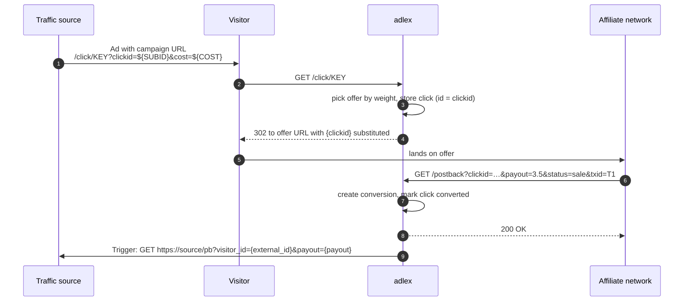

<div align="center">


# adlex

**A lightweight, self-hosted affiliate tracker in the spirit of Binom.**<br>
Campaigns · Offers · Traffic sources · Click redirects · Conversion postbacks · Outgoing triggers · Reports

[](https://nodejs.org)
[](https://expressjs.com)
[](https://ejs.co)
[](#tests)
[](#deploy-to-aws-elastic-beanstalk)
[](#data-layer)


</div>

---

## Table of contents

- [Why adlex](#why-adlex)
- [Features](#features)
- [How tracking works](#how-tracking-works)
- [Screenshots](#screenshots)
- [Quick start](#quick-start)
- [Usage guide](#usage-guide)
  - [1. Add a traffic source](#1-add-a-traffic-source)
  - [2. Add offers](#2-add-offers)
  - [3. Create a campaign](#3-create-a-campaign)
  - [4. Set up the postback from your network](#4-set-up-the-postback-from-your-network)
  - [5. Add a trigger (postback to the traffic source)](#5-add-a-trigger-postback-to-the-traffic-source)
  - [6. Read the reports](#6-read-the-reports)
- [Macros](#macros)
- [Public endpoints](#public-endpoints)
- [Roles](#roles)
- [Configuration](#configuration)
- [Data layer](#data-layer)
- [Deploy to AWS Elastic Beanstalk](#deploy-to-aws-elastic-beanstalk)
- [Tests](#tests)
- [Project layout](#project-layout)

---

## Why adlex

Commercial trackers are heavy and expensive for a handful of campaigns. adlex gives you the core loop, split-testing offers, matching conversions back to clicks, and telling your traffic source about them, in one small Node.js app with no build step and four runtime dependencies.

## Features

| | |
|---|---|
| 🎯 **Campaigns** | Weighted offer rotation, fallback URL, pause/archive, per-campaign postback token, one-click copy of the campaign URL with your source's macros already filled in |
| 🎁 **Offers** | URL templates with macros, default payout, network label, status |
| 🚦 **Traffic sources** | Parameter mapping (which query params carry click id, cost, sub1…sub5), cost model (fixed CPC / from param / none), presets for PropellerAds and Facebook |
| 🔁 **Conversions** | Incoming postback with txid de-duplication, upsert of status changes (lead → sale), rejected/refund statuses excluded from revenue |
| 📣 **Triggers** | Outgoing postbacks to the traffic source or any URL. Per source with per-campaign overrides, GET or POST (form/JSON), status filters, timeouts, retries with backoff, full request/response log with Test and Retry buttons |
| 📊 **Reports** | Clicks, uniques, conversions, CR, revenue, cost, profit, ROI, EPC, CPC grouped by campaign, offer or source, with date presets and custom ranges |
| 🧾 **Clicklog** | Every click with sub ids, IP, country, cost, conversion state; filters and cursor pagination |
| 👥 **Users** | Admin and read-only roles, session login, CSRF protection, first admin seeded from env |
| 🔌 **Portable data** | Firestore-shaped adapter over local JSON files today, real Firebase Firestore later with a one-file swap |

## How tracking works



Two ids matter and adlex never confuses them:

- `{clickid}` is **adlex's** click id. Put it in offer URLs so the network can send it back.
- `{external_id}` is the **traffic source's** click id, read from the mapped query param. Use it in triggers so the source can attribute the conversion.

## Screenshots

<table>
  <tr>
    <td align="center"><b>Campaign page</b><br>Campaign URL, postback URL, 7-day stats, offer split, triggers in effect<br></td>
    <td align="center"><b>Campaign editor</b><br>Source, cost, fallback, weighted offers<br></td>
  </tr>
  <tr>
    <td align="center"><b>Traffic source</b><br>Parameter mapping with presets<br></td>
    <td align="center"><b>Trigger editor</b><br>Outgoing postback with macros, retries, status filter<br></td>
  </tr>
  <tr>
    <td align="center"><b>Postback logs</b><br>Every attempt with resolved URL, response and Retry<br></td>
    <td align="center"><b>Clicklog</b><br>Filters, date range, cursor pagination<br></td>
  </tr>
  <tr>
    <td align="center"><b>Conversions</b><br></td>
    <td align="center"><b>Offers</b><br></td>
  </tr>
  <tr>
    <td align="center"><b>Triggers</b><br></td>
    <td align="center"><b>Users</b><br></td>
  </tr>
</table>

## Quick start

Requires Node.js 22 or newer.

```bash
git clone <this repo> adlex && cd adlex
npm install
cp .env.example .env          # set ADMIN_EMAIL and ADMIN_PASSWORD
npm run seed                  # optional demo data (run while the server is stopped)
npm run dev                   # http://localhost:8080
```

Log in with the admin email and password from `.env`. The seed script prints a ready-to-use campaign URL; you can also drive traffic through it from the terminal:

```bash
scripts/simulate.sh <campaignKey> 20 2     # 20 clicks, 2 postbacks
```

> **Note**
> The JSON store keeps each collection in memory per process. Never run two processes (for example `npm run seed` and the server) against the same `DATA_DIR` at the same time.

## Usage guide

### 1. Add a traffic source

**Traffic sources → New source** (or use the **+ PropellerAds** / **+ Facebook** shortcuts).

For each field, set the **query param name** adlex should read on `/click`, and the **source token** the source substitutes when it builds the URL. Choose the cost model:

| Cost model | Meaning |
|---|---|
| `cpc` | Every click costs the campaign's *Cost per click* |
| `param` | Read the cost from the mapped `cost` param; fall back to the campaign CPC if missing |
| `none` | No cost tracking |

### 2. Add offers

**Offers → New offer.** Paste the network's tracking link and put `{clickid}` where the network expects its sub id or click id, e.g.

```
https://network.example/aff_c?offer_id=123&aff_sub={clickid}&aff_sub2={sub1}
```

Set the default payout: it is used when a postback arrives without a `payout` parameter.

### 3. Create a campaign

**Campaigns → New campaign.** Pick the traffic source, add one or more offers with weights (70 / 30 sends roughly 70 % of clicks to the first offer), set the CPC and optionally a fallback URL and a postback token.

Open the campaign and press **Copy** next to **Campaign URL**. It already contains your source's macros:

```
https://your.domain/click/k7x2m9qa?clickid=${SUBID}&cost=${COST}&sub1=${ZONEID}
```

Paste that into the traffic source as the landing URL.

### 4. Set up the postback from your network

Copy the **Postback URL** from the campaign page and give it to the affiliate network, replacing the macros with the network's own:

```
https://your.domain/postback?clickid={clickid}&payout={payout}&status={status}&txid={txid}
```

Behaviour:

| Situation | Response |
|---|---|
| New conversion | `OK` |
| Same `clickid` + `txid` again | `DUPLICATE` (ignored) |
| No `txid`, first time | `OK` |
| No `txid`, again (e.g. lead → sale) | `UPDATED` (status and payout replaced) |
| Unknown `clickid` | `404 ERR unknown clickid` |
| Missing `clickid` | `400 ERR missing clickid` |
| Wrong `token` on a protected campaign | `403 ERR bad token` |

Statuses `rejected`, `refund`, `chargeback`, `cancelled` are stored but excluded from revenue.

### 5. Add a trigger (postback to the traffic source)

**Triggers → New trigger.** Choose the source, the event (`conversion` or `click`), the method and the URL template:

```
https://ad-network.example/conversion?visitor_id={external_id}&payout={payout}&status={status}
```

- Leave **Campaign** empty to make it the default for every campaign of that source. Set a campaign to override the default for that campaign only.
- **Only for statuses** limits firing to, say, `sale`.
- Failed attempts (timeout, network error, 5xx, 429) are retried with 2 s and 10 s backoff. Every attempt is logged under **Triggers → Logs** with the resolved URL, body, response and duration. Use **Test** to fire a sample request and **Retry** to resend a logged one.

### 6. Read the reports

**Reports** groups by campaign, offer or source for Today, Yesterday, 7 days, 30 days, All time or a custom range. Conversions are attributed to the **click's** date, so CR and ROI stay consistent for a range. The **Conversions** tab, by contrast, lists conversions by the time the postback arrived.

## Macros

Usable in offer URLs, trigger URLs and trigger bodies. Values are URL-encoded (or JSON-escaped in JSON bodies); unknown macros render as empty strings.

| Macro | Value |
|---|---|
| `{clickid}` | adlex click id |
| `{external_id}` | traffic source's click id |
| `{campaign_id}` `{campaign_name}` `{campaign_key}` | campaign |
| `{source_id}` `{source_name}` | traffic source |
| `{offer_id}` `{offer_name}` | offer |
| `{payout}` | conversion payout, 2 decimals |
| `{cost}` | click cost |
| `{status}` `{txid}` `{conversion_id}` | conversion |
| `{sub1}` … `{sub5}` | sub ids |
| `{ip}` `{country}` `{ua}` `{referer}` | visitor |
| `{timestamp}` `{date}` | event time (ms) and `YYYY-MM-DD` |

## Public endpoints

| Method | Path | Purpose |
|---|---|---|
| `GET` | `/click/:campaignKey` | Redirect visitor to an offer, store the click |
| `GET` `POST` | `/postback` | Record a conversion (`clickid`, `payout`, `status`, `txid`, `token`) |
| `GET` | `/health` | Health check for load balancers |

Everything else requires a login.

## Roles

| Role | Can |
|---|---|
| `admin` | Everything, including the Users tab |
| `user` | View every tab except Users; all edits are refused |

The first admin is created from `ADMIN_EMAIL` / `ADMIN_PASSWORD` when the users collection is empty.

## Configuration

All settings come from environment variables (a local `.env` is loaded automatically if present).

| Variable | Default | Description |
|---|---|---|
| `PORT` | `8080` | Listen port |
| `BASE_URL` | `http://localhost:8080` | Public URL used to render campaign and postback URLs |
| `DB_DRIVER` | `json` | `json` today, `firestore` later |
| `DATA_DIR` | `./data` | Where the JSON collections live |
| `DB_STRICT` | `1` in dev | Throw on queries Firestore would reject |
| `SESSION_SECRET` | dev value | Required (≥ 16 chars) in production |
| `COOKIE_SECURE` | `false` | Set `true` once you serve HTTPS |
| `TRUST_PROXY` | `0` | Proxy hops to trust for the real client IP (`1` behind an ALB) |
| `ADMIN_EMAIL` `ADMIN_PASSWORD` | | First admin account |
| `LOG_CLICKS` | `1` | One JSON log line per click and postback |

## Data layer

Application code never touches storage directly. It talks to a small adapter (`src/db/adapter.js`) whose surface is the Firestore SDK's:

```js
db.collection('clicks')
  .where('campaignId', '==', id)
  .where('createdAt', '>=', from)
  .orderBy('createdAt', 'desc')
  .limit(50)
  .get();
```

Today the adapter is implemented by `src/db/jsonStore.js`: one JSON file per collection, in-memory maps, debounced atomic writes (temp file → fsync → rename). Strict mode rejects any query the real Firestore would refuse, so the code base is migration-safe by construction.

To move to Firebase: implement `createFirestoreStore()` in `src/db/firestoreStore.js` (the official SDK already matches the surface), create the composite indexes listed there, and set `DB_DRIVER=firestore`. Nothing else changes.

## Deploy to AWS Elastic Beanstalk

Platform: **Node.js 22 on 64bit Amazon Linux 2023**, single instance.

```bash
eb init adlex --platform "Node.js 22 running on 64bit Amazon Linux 2023" --region eu-central-1
eb create adlex-prod --single
eb setenv SESSION_SECRET=$(openssl rand -hex 32) \
          ADMIN_EMAIL=you@example.com ADMIN_PASSWORD='choose-a-strong-one' \
          BASE_URL=http://adlex-prod.eu-central-1.elasticbeanstalk.com
eb open
```

What is already wired up:

- `Procfile` starts the app; it listens on `process.env.PORT`.
- `.ebextensions/01-env.config` sets `/health` as the health-check path, `TRUST_PROXY=1`, and `DATA_DIR=/var/app/data`.
- `.platform/hooks` create the data directory outside the app folder so JSON files survive redeploys.
- `SIGTERM` flushes pending writes before exit.

> **Warning**
> Instance disk does not survive instance replacement or scaling. Treat the JSON driver as demo-grade on EB and switch to Firestore before real traffic. Once HTTPS is terminated at the load balancer, set `COOKIE_SECURE=true` and an `https://` `BASE_URL`.

## Tests

```bash
npm test
```

Built-in `node:test`, no extra dependencies. Covers the query engine (Firestore semantics, cursors, strict mode), the JSON store (atomic persistence, batches, copies), macros, weighted rotation, cost models and conversion de-duplication.

## Project layout

```
server.js                 entry: env, seed admin, listen, graceful shutdown
src/app.js                Express wiring: sessions, CSRF, roles, routes
src/db/                   adapter contract, query engine, JSON store, Firestore stub
src/lib/                  ids (ULID), macros, time ranges, cache, csrf, logger
src/middleware/           auth/roles, error pages
src/services/             campaigns, offers, sources, tracking, conversions, postbacks, reports, users
src/routes/               one router per tab + public tracking endpoints
views/                    EJS templates and partials
public/                   stylesheet, small vanilla JS, favicon
scripts/                  seed-demo.js, simulate.sh
test/                     node:test suites
.ebextensions, .platform  Elastic Beanstalk configuration
```

---

<div align="center">
Built with Node.js, Express and EJS. No build step, no frontend framework, four dependencies.
</div>
